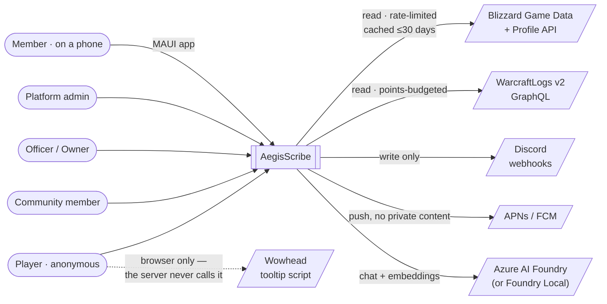
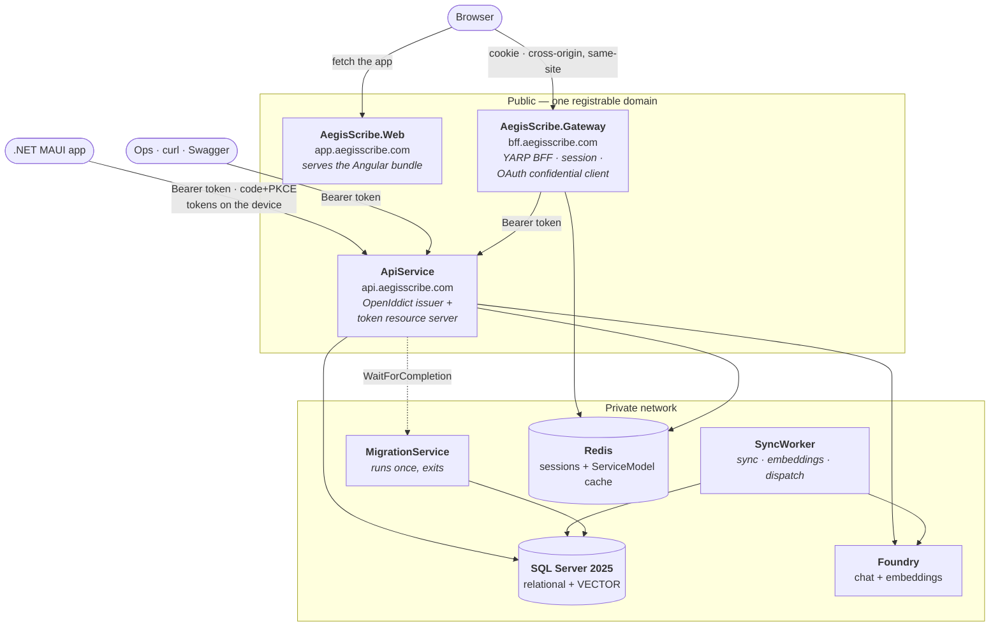
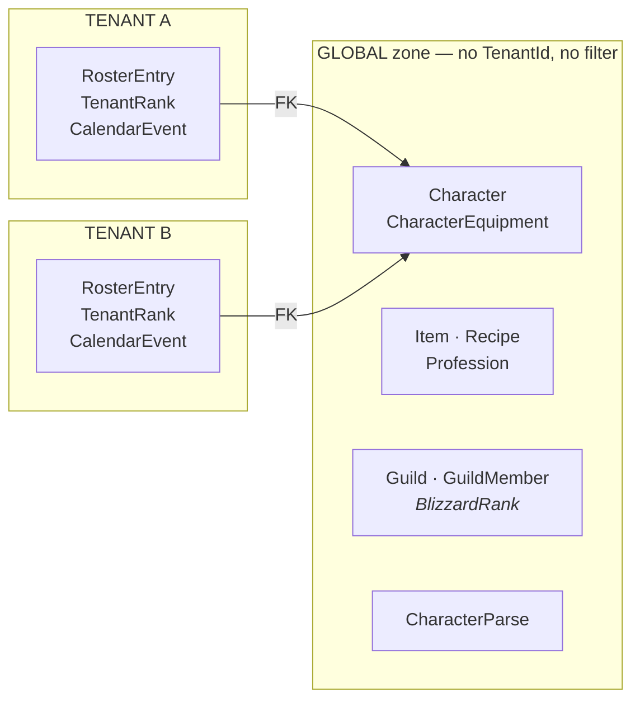
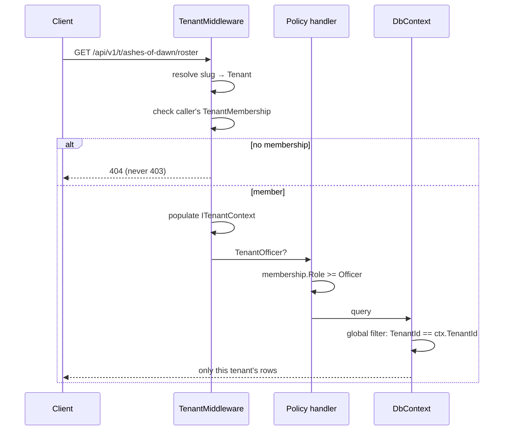
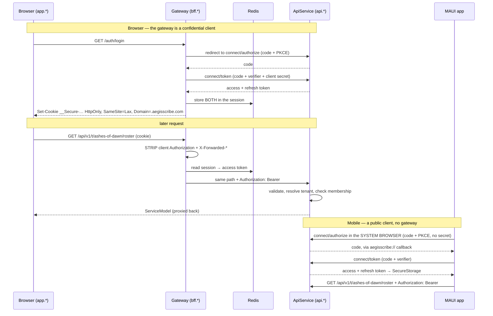
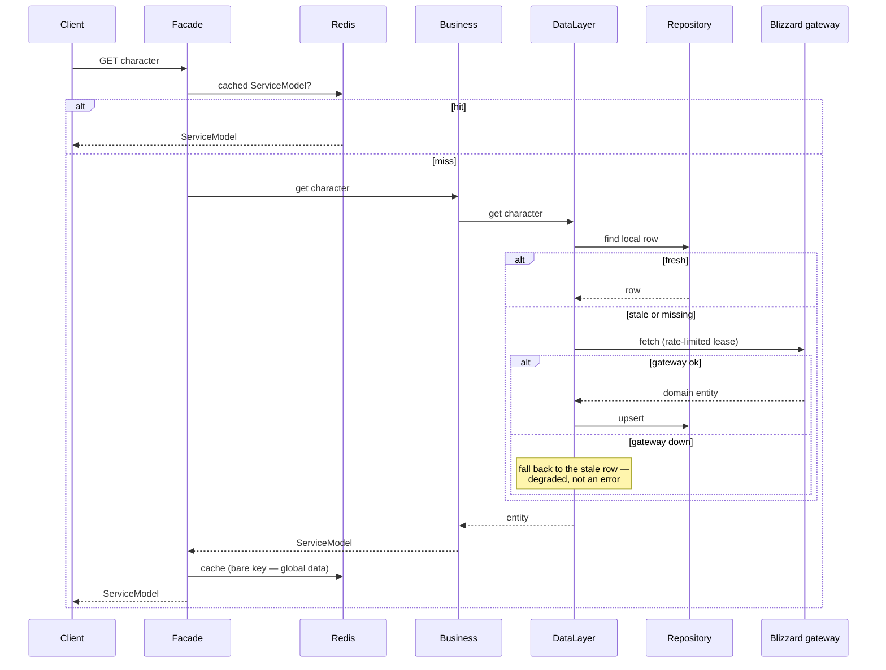
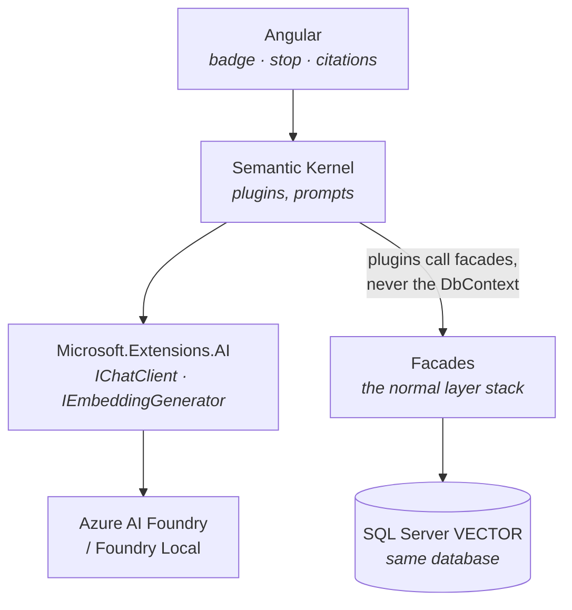
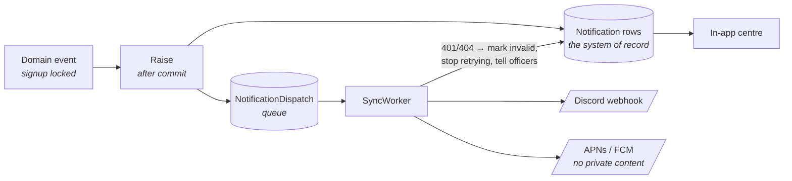

# AegisScribe — Architecture

*High-level design: what the system is made of, how a request moves through it, and which decisions
are load-bearing. Written for someone joining the project, or returning to it after six months.*

**This document explains; it does not govern.** The authority is `CLAUDE.md` at the repo root and the
path-scoped rules in `.claude/rules/`. Where this document and a rule disagree, the rule wins and this
document is what needs fixing.

---

## 1. What it is

A **multi-tenant World of Warcraft armory and guild-operations platform**. A community signs up, links
its guilds, and gets a character armory, a roster with its own ranks, a raid calendar with signups and
attendance, notifications where the guild actually lives, and an AI layer that reads all of it.

Two audiences, and they pull in different directions:

- **Players** want a fast, anonymous character lookup. No login, no community, just a URL.
- **Communities** want private, authenticated, tenant-scoped operations on top of that same data.

Most of the architecture below is the consequence of serving both without letting the second leak into
the first, or the first multiply the cost of the second.

---

## 2. System context



The dashed line is deliberate. **Wowhead is reached only by the viewer's browser**, never by our
server — there is no public API and their terms bar automated access. Every server-side image, item
stat and recipe comes from Blizzard.

---

## 3. Containers

Everything is orchestrated by the Aspire AppHost. **Three deployables are publicly addressable; the
rest are private.**



| Container | Public? | Responsibility |
|---|---|---|
| **Web** | `app.*` | Serves the built Angular bundle and injects the gateway URL at runtime. No auth, no session, no API calls. A file server with one config endpoint. |
| **Gateway** | `bff.*` | The BFF, and an OAuth **confidential client**. Runs the code+PKCE flow for the browser, keeps both tokens in a Redis session, strips client-supplied headers, proxies `/api/*` to the API via YARP. No database, no business logic, no tenant opinion. |
| **ApiService** | `api.*` | Every synchronous request, **and** token issuance via OpenIddict. Hosts the controllers; the layered stack, tenancy and the AI vertical come from the `AegisScribe.Domain` library it references. A token resource server — no cookies, no session, **no CORS policy**. Called directly by the mobile app and by ops; never by the SPA. |
| **Mobile** | n/a | .NET MAUI. An OAuth **public client** — no secret, PKCE, system-browser sign-in, tokens in platform secure storage. Not an Aspire resource; it is a client, not a service. |
| **SyncWorker** | no | Everything asynchronous: external sync, embedding backfill, recurrence materialisation, notification dispatch. Runs **outside any tenant** for global work. |
| **MigrationService** | no | Applies EF migrations once through an execution strategy, then exits. The API `WaitForCompletion`s on it. |
| **SQL Server 2025** | no | Relational store **and** vector store. Pinned to a 2025 image — the 2022 default has no `VECTOR` type. |
| **Redis** | no | Gateway sessions **and** the API's ServiceModel cache. Two uses, one instance. |
| **Foundry** | no | Chat and embeddings as separate named deployments. `RunAsFoundryLocal()` offline. |

**Three public hostnames; the worker and migration service have none.** The API is public because the
mobile app calls it directly and because you can then curl production and diagnose an incident. You
pay for that with per-client rate limiting, mandatory versioning, no CORS policy at all, and OpenAPI
in non-production only. **The token is the security boundary either way** — it was already doing that
work when the gateway was the only caller.

**Two front doors, one authorization path.** Both clients present the same bearer token to the same
resource server; only the token's custody differs. That is what keeps a second front end from
doubling the security surface.

**One database, one `DbContext`.** Identity, global reference and tenant tables share
`AegisScribeDbContext` and one migration history, because a tenant-scoped write frequently touches an
Identity user and a domain row together.

---

## 4. The tenancy model — the defining decision

A **tenant is a Community**: a group owning one or more guilds, possibly across realms and factions.
Isolation is a **shared database with a `TenantId` discriminator and a global EF query filter**.

### The two zones

The important half is what *isn't* tenant-scoped.



**One global `Character` row, N tenant `RosterEntry` rows pointing at it.**

Character gear, items and recipes are *public Blizzard data* — identical for every community. Copying
them per tenant would multiply Blizzard API calls by tenant count and breach the rate limit on the
third community. So sync runs **once, globally**, and a community's private view of a character is a
separate, tenant-scoped row.

Foreign keys point **tenant → global only**. A global entity holding an FK to a tenant-scoped one
would make shared data depend on one community's rows.

The same split produces two distinct rank concepts, which are easy to confuse and must not be merged:

| | Source | Zone |
|---|---|---|
| `GuildMember.BlizzardRank` | what the **game** says (0–9, from the roster endpoint) | global |
| `RosterEntry.TenantRankId` | what the **community** says ("Raider", "Trial") | tenant |

### How a tenant is resolved



Four invariants make this hold:

1. **The tenant comes only from the route.** Never a header, body, query string, or the user's
   `LastTenantId`. A client-supplied tenant id is horizontal privilege escalation with a friendly name.
2. **`ITenantContext` throws when unresolved.** Fail closed — a silent default puts every row in one
   tenant.
3. **The query filter is applied by convention**, looping over `ITenantScoped` types, so the developer
   adding entity number forty cannot forget it.
4. **404, never 403**, for a tenant you're not in. A 403 confirms the tenant exists.

`IgnoreQueryFilters()` is banned outside two places: the worker/migration service, and the erasure
routine — both of which are legitimately cross-tenant, and both of which must say so in a comment.

### Why Identity roles aren't the authorization model

A person can be an officer in one community and a plain member in another. ASP.NET Identity roles are
global to the account and cannot express that. So Identity has exactly one role — `PlatformAdmin` —
and everything else is `TenantMembership`, a domain entity, with policies that evaluate against the
*resolved* tenant.

`[Authorize(Roles = "Officer")]` anywhere in this codebase is a bug that grants officer rights in every
community the person belongs to.

---

---

## 4b. The edge — two front doors, one boundary

There are two kinds of client. Both end up presenting the same bearer token to the same resource
server; what differs is **who holds the token**.



**The same flow, run by two clients with different capabilities.** The gateway can hold a secret
because it is a server; the app cannot, because anything shipped to a device is public — PKCE is what
replaces the secret. That symmetry is the point: the API has one authorization path to implement,
test and audit, not one per front end.

Four properties the cookie half buys, each lost by putting a token in the browser:

- **An XSS cannot exfiltrate a portable credential.** The cookie is `HttpOnly`; JavaScript never sees
  a token.
- **Logout is instant**, because the session is server-side in Redis rather than encoded in a token
  that must expire — and the gateway revokes the refresh token on the way out.
- **The API is a genuine independent deployable**, which is what let a mobile client be added without
  redesigning it.
- **The SPA ships on its own cadence**, from its own host, without touching the API.

None of that argues for the *mobile* app using a cookie. A native app has no gateway to hold a
session, no origin, and no DOM for an XSS to live in; tokens in platform secure storage are the right
answer there and the wrong one in a browser. **"Mobile holds tokens, so the SPA may as well" is the
inference this architecture exists to refuse.**

Three details are easy to get wrong and all three fail silently:

- **`app.*` and `bff.*` are cross-origin but same-site.** CORS applies — explicit origin, credentials,
  never a wildcard — but the cookie survives with `SameSite=Lax` and `Domain=.aegisscribe.com`. Two
  genuinely *different* registrable domains would force `SameSite=None`, which Safari's ITP blocks by
  default; auth would simply fail for those users. The `Domain` attribute also means **no untrusted
  content may be hosted on any subdomain**, which is now a DNS-level security rule.
- **The gateway must strip client-supplied `Authorization` before setting its own.** Otherwise a
  caller presents their own bearer token, the gateway forwards it, and the API cannot distinguish it
  from one the gateway obtained.
- **The API still has no CORS policy, and that is not an oversight.** CORS is a browser mechanism; a
  native app has no origin and sends no preflight, so mobile needs nothing from it. The absence keeps
  doing exactly what it did — no browser can read an API response cross-origin, even with a stolen
  token.

**Tokens carry `sub` and nothing tenant-shaped.** Membership is resolved per request against the
database, so a demotion takes effect on the next call rather than at the next refresh. With a 14-day
refresh token this matters more than it did: a tenant claim minted at sign-in could be a fortnight
stale, and an officer demoted on Monday would keep officer rights on their phone until Friday.

Two traps worth naming, because both cost a day:

- **ASP.NET Core Identity's built-in bearer tokens are not JWTs.** They are opaque,
  Data-Protection-encrypted blobs validatable only by the issuing process, so `MapIdentityApi`'s
  bearer mode is useless for a separated API. Identity is the *user store*; OpenIddict is the
  protocol layer above it.
- **OpenIddict's access tokens are encrypted JWTs (JWE), so `AddJwtBearer` cannot read them.**
  Validation uses `AddValidation(o => o.UseLocalServer())`, which shares the server's keys directly.
  Reaching for `DisableAccessTokenEncryption()` to make the familiar API work trades a real protection
  for familiarity.

## 5. The request path

```
Controller  →  Facade              →  Business                →  DataLayer          →  Repository
  (HTTP:        (validate the VM +      (translate VM→domain,      (compose data          (EF queries)
   VM in,        cache; return SM)       apply domain rules,        operations; owns    ↘  Gateway
   SM out,                               domain→SM)                 cache-first +          (external
   [Authorize])                                                     transactions)           HTTP)
```

Each layer depends on the **interface** of the one below. ViewModels come in, ServiceModels go out,
domain entities live between, and no EF entity crosses the controller boundary.

The stack spans two projects. Controllers live in **`AegisScribe.ApiService`**, the HTTP host.
Everything from the facade down lives in **`AegisScribe.Domain`**: facades, business, data layers,
repositories, the `DbContext` and its migrations, gateways, AI plugins, and the models, validators
and mappers. The API, the sync worker and the migration service reference Domain; Domain references
none of them and holds no HTTP types. The split makes "the controller skipped the facade" a visible
cross-project reference instead of a quiet shortcut, and lets the worker share repositories and
gateways without referencing a web host.

Where responsibility sits, when it's ambiguous — **delete the call and ask what breaks**:

- The user gets a **wrong answer or an action that should have been refused** → domain rule →
  **Business**.
- The answer is still correct but the **store is left stale or inconsistent** → bookkeeping →
  **DataLayer**.

### A cache-first read, end to end



Three details in that diagram are load-bearing:

- **The gateway call happens outside any transaction callback.** The callback is retryable under the
  Aspire execution strategy; an HTTP call inside one fires again on every retry.
- **A gateway failure returns the stale row**, and the UI says how old it is. Degradation is a designed
  state, not an error path.
- **Cache keys are keyed by zone** — global ServiceModels under a bare key, tenant-scoped ones under
  `t:{tenantId}:...`. Getting that backwards leaks across communities in one direction and fragments
  the shared cache N ways in the other.

---

## 6. External integrations

| System | Posture | Governing constraint |
|---|---|---|
| **Blizzard Game Data + Profile** | Server-side read, cached into SQL. Sync is **global**. | Terms of Use: refresh ≤30 days, honour deletion, attribute without implying endorsement, no trademark in title or URL, 36,000 calls/hour. |
| **WarcraftLogs v2** | Server-side GraphQL read for parses and attendance. Global zone. | **Points-based** rate limiting — track spend via `rateLimitData`, not request counts. A 200 with a non-empty `errors` array is a failure. |
| **Discord** | **Outbound only.** Per-tenant webhooks, queued and retried from the worker. | The webhook URL is a credential: encrypted at rest, masked in responses, absent from logs. |
| **Wowhead** | **Client-side only** — outbound anchors decorated by their tooltip script. | No public API; Fanbyte's terms bar automated access. A `PreToolUse` hook blocks server-side requests from being written. |

**Images** come exclusively from Blizzard media endpoints (`/data/wow/media/item/{id}`,
`/data/wow/media/spell/{id}`, guild crest components, character renders). They are 36–56px icons with
no large art available, some ids 404, and a documented set has been plainly wrong for years — so every
icon needs a fallback and nothing may assume fidelity.

### The rate-limit story

This is where tenancy and external APIs meet, and it is the reason the design scales:

- **Background sync is global** — once, for everyone. Tenant count does not multiply API calls.
- **Tenant-triggered sync draws on `ITenantSyncBudget`**, not the shared limiter, so one community
  cannot starve another. Exhaustion is a 429 with a retry hint, not a silent queue.

---

## 7. The AI vertical



The one structural rule: **Semantic Kernel plugins call facades**. That single constraint is what makes
tenancy, authorization, validation and caching apply to the AI path without being reimplemented there.
A plugin that queries EF directly has silently opted out of all four.

Two safety patterns carry the risky features:

- **Reads** — natural-language queries produce a *constrained filter object* over enums of whitelisted
  fields and operators, validated per-field against the caller, then translated to LINQ. No model
  output ever reaches raw SQL.
- **Writes** — natural-language scheduling produces a *constrained command object*, which is
  **previewed as concrete events, explicitly confirmed, and written idempotently**. The model emits a
  recurrence rule; server code expands it in the tenant's timezone, because asking a model to enumerate
  dates across a daylight-saving boundary produces a wrong answer stated confidently.

Output that judges people — attendance insight, recruitment fit, loot guidance — cites the rows it
used, states what it doesn't know, describes behaviour rather than character, and is visible to the
person it describes.

---

## 8. Notifications



The in-app centre **is** the system of record; Discord and mobile push are delivery channels on top of
it. Raising happens **after** the transaction commits, and recipient fan-out happens at raise time —
not at delivery time, when the roster may have changed.

**Push is a third channel on the same pipeline, not a second pipeline.** A notification the user has
muted must be muted everywhere, and two pipelines is how that stops being true. Device registrations
are tenant-scoped, so leaving a community stops its notifications reaching that phone — and a push
payload carries an id, never content, because it renders on a lock screen in front of whoever is
holding the device.

---

## 9. Cross-cutting concerns

| Concern | Approach |
|---|---|
| **Identity** | ASP.NET Core Identity as the **user store** (local accounts); OpenIddict is the protocol layer above it. The API has no cookie auth, no login form and no antiforgery. Logout is a gateway session drop for the browser, `connect/revoke` for mobile. |
| **Authorization** | Tenant membership policies (`TenantMember`/`Officer`/`Owner`); `PlatformAdmin` for platform work; resource rules ("is this mine") in Business. |
| **Caching** | Redis for ServiceModels (minutes); SQL as the Blizzard cache (days, capped at 30 by the ToU). Distinct concerns, distinct TTLs, distinct owners. |
| **Transactions** | `ExecuteInTransactionAsync` takes a **callback** — the Aspire retry execution strategy refuses a caller-opened transaction. The callback may run twice, so it must be idempotent and contain no HTTP. |
| **Migrations** | Applied once by the MigrationService. The vector index and `PREVIEW_FEATURES` need reviewed raw SQL. |
| **Time** | Store UTC; compute in the tenant's IANA zone; render both and always label which. Recurrence materialises concrete rows in a bounded window. |
| **Observability** | ServiceDefaults wires OpenTelemetry, health checks, resilience. Model calls and token usage are traced like any dependency. |
| **Audit** | Every officer action on another person's data writes an `AuditLog` row. |
| **Erasure** | One routine, cross-tenant by design, writing a `SyncSuppression` tombstone the gateway and worker both respect — a plain DELETE is undone by the next sync. |

---

## 10. Key decisions and their trade-offs

The decisions worth knowing before changing anything.

| # | Decision | Why | What it costs |
|---|---|---|---|
| 1 | **Shared DB + `TenantId` discriminator** rather than schema- or database-per-tenant | Cheapest to run, scales to thousands of communities, one migration | A missed filter is a silent cross-tenant leak — mitigated by convention-applied filters, a mandatory two-tenant test, and a dedicated auditing subagent |
| 2 | **Global zone for external data** | Stops tenant count multiplying Blizzard API calls; one character syncs once for everyone | Two zones to keep straight, and getting an entity's zone wrong is a real bug in both directions |
| 3 | **Tenant membership, not Identity roles** | A person's rank differs per community; Identity roles are global to the account | Custom requirement handler; policies can't be reasoned about without the resolved tenant |
| 4 | **Path-based tenant resolution** (`/api/v1/t/{slug}`) | No wildcard DNS or TLS; the URL always shows which community you're in | Slightly longer routes; the slug is in every client-side URL construction |
| 5 | **One `DbContext`** for Identity, global and tenant data | Claiming a character touches Identity and domain in one transaction | Identity migrations and domain migrations share a history |
| 6 | **Layered stack with a DataLayer seam** | Lets cache-first external reads be added without touching Business | An extra layer that is often a one-line pass-through, which looks redundant until Phase 6 |
| 6b | **The layers live in their own `AegisScribe.Domain` project** | Controllers can only reach what Domain exposes, so skipping the stack becomes a visible reference; the sync worker and migration service share repositories, gateways and the `DbContext` without referencing the web host | One more project, and EF tooling needs `--project`/`--startup-project` because the context and the Aspire registration live in different projects |
| 7 | **Vectors in SQL Server, not a separate store** | One database, one backup, one transaction; no second system to operate | Ties us to SQL Server 2025; the approximate index is still preview |
| 8 | **Semantic Kernel, not Microsoft Agent Framework** | Deliberate choice at time of writing; SK is supported and GA | MAF is where new agent investment is going — revisit consciously, don't drift |
| 9 | **Constrained objects, never model-generated SQL** | Sanitizing generated SQL is a denylist problem nobody has won | Every filterable field is an explicit switch arm — new capability needs a code change, which is the point |
| 10 | **Wowhead as a link target only** | No public API; their terms bar automated access | We ship 56px Blizzard icons instead of Wowhead's better art, and link out for the rest |
| 11 | **YARP BFF at the edge; cookie for the browser, tokens for the API** | Real tokens and an independently deployable API, without a token in the browser's XSS blast radius | A third deployable to run, plus a Redis session store the gateway depends on |
| 12 | **Three hostnames on one registrable domain** | SPA, gateway and API deploy and scale separately, while the cookie stays same-site and usable in Safari | CORS is back; the cookie's `Domain` attribute means no untrusted content on any subdomain, forever |
| 12b | **The API is publicly addressable, not hidden** | You can curl production, read OpenAPI in non-prod, and diagnose an incident without first deducing which hop failed — the debuggability cost of a private API is real | Its own edge to harden: rate limiting, a **public** token endpoint protected by PKCE rather than by network position, no CORS policy, and a public surface that gets scanned |
| 13 | **Discord and push; no email** | Where guilds actually are, and no deliverability or unsubscribe burden | No reach for people who use neither the guild's Discord nor the app |
| 14 | **OpenIddict rather than a hand-written issuer** | A public mobile client needs PKCE verification, single-use codes, refresh rotation with replay detection and revocation — each easy to write *almost* correctly, and "almost" passes every test | A dependency, four more tables, and a token-pruning job the sync worker has to run |
| 15 | **Mobile is a public OAuth client; the SPA keeps the BFF** | Each client gets the credential custody its threat model deserves, while the API keeps exactly one authorization path | Two auth paths to test, and a standing argument to relitigate ("mobile holds tokens, why can't the SPA") |
| 16 | **Versioned API from the first endpoint** | A shipped phone cannot be redeployed; old clients call the API for months after a release | Every route carries a segment that is noise until the day it isn't, plus a committed OpenAPI artefact to review |

---

## 11. Failure modes, and what stands in the way

| Failure | Why it's likely | What protects against it |
|---|---|---|
| **Cross-tenant leak** | Silent — doesn't throw, doesn't log, passes any single-tenant test | Convention-applied filters, `IgnoreQueryFilters` ban, tenant-prefixed cache keys, mandatory two-tenant test, `@tenant-isolation-auditor` |
| **Breaking a shipped mobile client** | Nothing fails in CI; the damage is on devices you can't reach, and a store review stands between the fix and the user | Versioned routes, the committed OpenAPI document reviewed in every PR, `@api-contract-checker`'s breaking-change table, deprecation headers, and a forced-upgrade path for when it happens anyway |
| **A secret shipped in the mobile app** | It looks like ordinary configuration, and it works | The mobile client is registered as `ClientTypes.Public` — there is no secret for it to hold, and `@code-reviewer` treats one as a Blocker |
| **An embedded WebView login** | It is the easiest thing to build and looks native | `.claude/rules/mobile.md` names it a Blocker; `WebAuthenticator` is the only sanctioned path |
| **Silent sign-outs on mobile** | A dropped connection during refresh is indistinguishable from a revoked token if you treat both as failure | Single-flight refresh, rotation persisted before use, `invalid_grant` distinguished from a network error, and the server's 30-second reuse leeway |
| **Rate-limit breach** | One innocent `Task.WhenAll` over a guild roster | Shared limiter with leases, bounded concurrency, global-not-per-tenant sync, per-tenant budgets, `@external-compliance` |
| **ToU breach by drift** | A TTL raised during a performance tune | 30-day cap asserted by a unit test; erasure completeness asserted by another |
| **Prompt injection via game text** | Character names, guild notes and applications are player-authored | Untrusted text fenced and labelled as data in prompts; `@ai-guardrails` |
| **Calendar off by an hour** | Recurrence expanded in UTC across a DST boundary | One shared time helper; expansion in the tenant zone; tests naming a real transition date |
| **Silently dead Discord webhook** | Nobody notices until someone misses a raid | Per-channel delivery status in the UI; 401/404 marks the webhook invalid and notifies officers |
| **Forged bearer accepted** | The gateway forwards a client-supplied `Authorization` header | The strip transform, and a test asserting a forged header never reaches the API |
| **Token leaks to the browser** | A well-meaning change returns a token to the SPA — made likelier by the mobile app legitimately doing exactly that | A test grepping every gateway response for `eyJ`; the SPA/mobile distinction stated in `gateway.md`, `auth.md` and `@code-reviewer` |
| **CORS added to the API** | Someone adds a permissive policy while debugging, letting a browser call `api.*` directly with a stolen token | Stated in CLAUDE.md → Restrictions and `backend.md`; checked by `@code-reviewer` |
| **Public API scanned or abused** | A public hostname is found within hours of DNS propagating | Rate limiting partitioned per `sub` and per `client_id`, not per IP alone — a carrier NAT puts a whole city behind one address. Tightest bucket on anonymous character lookup |
| **Token endpoint reachable** | It is public by necessity — a public mobile client has no secret to gate it with | The protocol is the control: PKCE required, codes single-use and short-lived, refresh tokens rotated with reuse detection. Adding a secret to the mobile client to "re-gate" it is a Blocker |
| **Auth broken in Safari** | Moving the SPA to a different registrable domain forces `SameSite=None` | The subdomain constraint is a recorded decision, not an implementation detail |
| **Design drift** | Colours invented per component | Tokens copied not invented; literal hex is a defect; `@design-review` |

---

## 12. Known preview surface

Parts of the stack are preview and will move. Confirm before writing against a remembered signature.

- `Aspire.Hosting.Foundry` — **preview**, recently renamed from `Aspire.Hosting.Azure.AIFoundry`.
- SQL Server approximate vector index (`CREATE VECTOR INDEX`, DiskANN) — **preview**, needs
  `PREVIEW_FEATURES`. The `VECTOR` type and `VECTOR_DISTANCE` are GA, and EF Core 10's mapping is GA;
  `WithApproximate()` is experimental.
- `Microsoft.SemanticKernel.Connectors.SqlServer` — **deprecated**, renamed to
  `CommunityToolkit.VectorData.SqlServer`. This repo uses neither; vectors live on our own EF entities.
- WarcraftLogs schema docs return 403 to automated fetching — use the browser explorer.
- **OpenIddict is GA, but versions fast.** 7.7.0 shipped 2026-09-06 and targets net10.0; confirm the
  current version and the builder API before writing configuration from memory.
- `WebAuthenticator` **does not implement PKCE**. It performs the browser round-trip and returns the
  callback's query parameters; the verifier, `state` check and token exchange are the app's own code.
  Its `WebAuthenticatorResult.AccessToken` is null in an authorization code flow — read
  `Properties["code"]` — and a sample that populates it is demonstrating a flow this repo does not
  use.

---

## 13. Where the rules live

This document describes the shape. The enforceable detail lives here:

| Concern | File |
|---|---|
| Everything, in brief | `CLAUDE.md` |
| **Tenancy** — read first | `.claude/rules/tenancy.md` |
| Orchestration | `.claude/rules/aspire.md` |
| Backend layering | `.claude/rules/backend.md` |
| Identity, tokens and membership | `.claude/rules/auth.md` |
| The gateway and the edge | `.claude/rules/gateway.md` |
| **API versioning and evolution** | `.claude/rules/api-contract.md` |
| The .NET MAUI client | `.claude/rules/mobile.md` |
| External sources | `.claude/rules/external.md` |
| AI | `.claude/rules/ai.md` |
| Frontend and design system | `.claude/rules/frontend.md` |
| Visual source of truth | `design/aegisscribe-armory.html` |
| Build sequence | `docs/scrub-prompts.md` |

Eight read-only subagents in `.claude/agents/` audit against those rules. The one to run after any
tenant-scoped change is `@tenant-isolation-auditor`; it exists because it is the only thing that
catches the failure nothing else can see.
